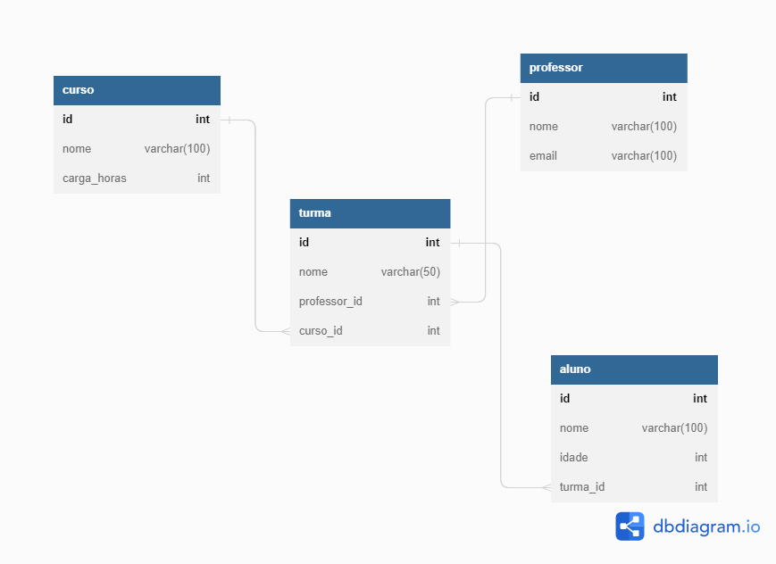

# Banco de Dados Resilia

Criando um banco de dados simples para o projeto do curso de Desenvolvimento Web da Resilia. 

## Projeto
Foi passado que tinhamos que criar um banco de dados para o curso Resília, depois responder perguntas sobre quais entidades existem e inserir registros.

## Perguntas

⇨ Existem outras entidades além dessas três? 
Pensando em um modelo de curso, é possível pensar em outras entidades importantes para um banco de dados. Para esse trabalho, criei a entidade de "Alunos"

⇨ Quais são os principais campos e tipos?
Para alunos, os atributos definidos foram nome e email como varchar e id como int. Para cursos, os atributos definidos foram id como inteiro e nome como varchar. Para professores foram definidos os atributos de nome e email como varchar e id como int. Para turma, foram definidos id como int, semestre/professor/curso como varchar.

⇨ Como essas entidades estão relacionadas? 
Foram definidas três chaves estrangeiras que fazem as ligações entre entidades. Aluno recebe uma FK turma_id que se relaciona com o id de turmas. Turmas recebe curso_id e professor_id que se relaciona com os ids das entidades cursos e professor. 

  <h1>Diagrama Resília</h1>

